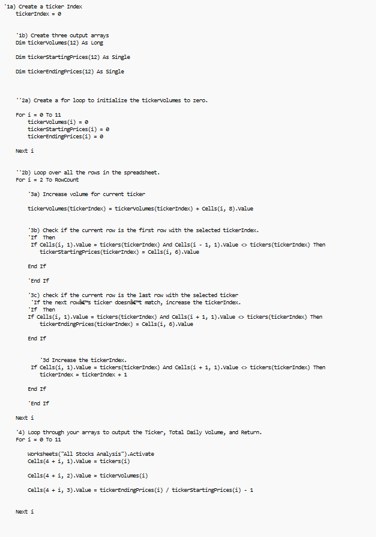
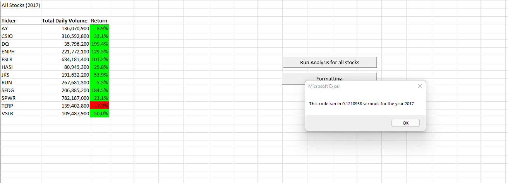
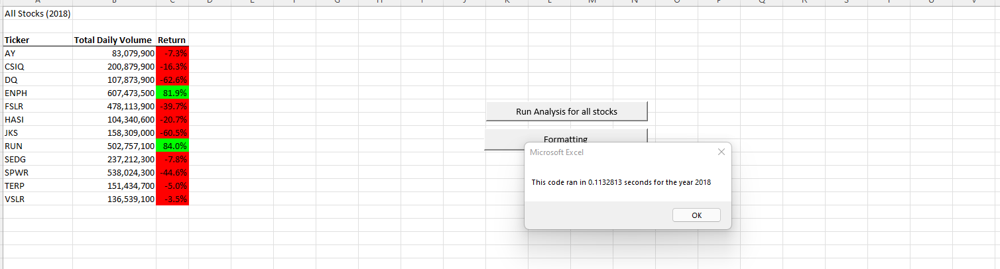

# VBA Stock Analysis

## Overview of Project

Steve is now looking to do a little more analysis on the entire stock market over the last few years. He wants to expand the data set and perform the same analysis report for more than the 12 stocks we initially evaluated. 

### Purpose

The purple of this challenge is to *Refactor* the data set by fixing the initial code to make the process much faster to process. Instead of running through each of the columns and rows separately, we'll be introducing a function known as *Index* in order to run through the entire array of data at once. We're looking to simplify the process for Steve so he is able to move through the data set quicker.

## Results

As per the VBA Code results shown in the image below, we modify a few steps from the original code. First, we initialize the tickerIndex by setting it to zero and then creating three output arrays to run through the dat set together. What's also different here is tickerVolumes is set to *Long* and both starting and ending prices are set as *Single* due to it requiring less bytes. A loop is then created setting all arrays to zero before we loop through all rows. Then we follow the same process but use *tickerIndex* in the code to check if the current row is the last or first row, and to increase volume for the current ticker all at once as we run through the data set. 

Below are the run times on each of the analysis reports run for both 2017 and 2018. The results below indicate that the run times were indeed faster than the old code by at least 0.5 seconds. The code ran in 0.12 second for 2017 and 0.11 seconds for 2018. 

The results also indicate that the returns in the overall portfolio of tickers was greater than the returns from 2018. The only ticker that shows increased returns from 2017 to 2018 is **Run**. This may be a stock well worth evaluating in the long run as daily volume also increased.

## Summary on Advantages and Disadvantages of Refactoring

1) Advantages of refactoring code is that it helps improve the code in order to impove the layout as well as data run times. This makes the code easier to understand and less complex.

Disadvantages of refactoring may be that it takes longer to work on the code, and you run the risk of the code not working. 

2) Advantages for refactoring VBA script include making it easier to run through the data by assigning a variable within the data type. The time it takes to run the script is also cut short, so everytime the data in the chart changes it becomes easy and fast to obtain results again. Reports like this one are good to refactor if you are rerunning them on a daily basis and working with new data each time. Advantage of the original script is that although it may need improvements, you don't run the risk of an error while running the code and having to spend more time fixing and running it again. Keeping an original script is good if you are only running it once in a while. 

Disadvantages of the original script is that it is slower and takes more line entries at times. Looping and nesting can also get confusing and it becomes hard for a third party to read if it is not cited correctly with steps and indentation. Disadvantage however of the refactored script is your spending more hours fixing it which takes up valuable time. You could always use outside resources, however you would have to alter other codes to fit the needs of yours. If you do not have previous knowledge in Syntax and order of logical operations, then you may not be able to refactor correctly. 

Disadvantages of refactorin
